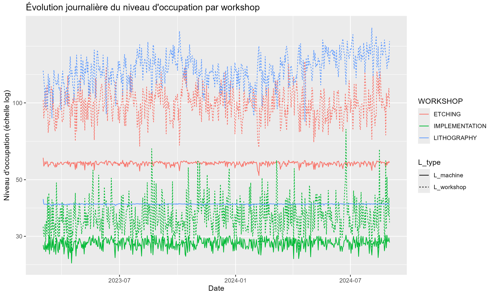
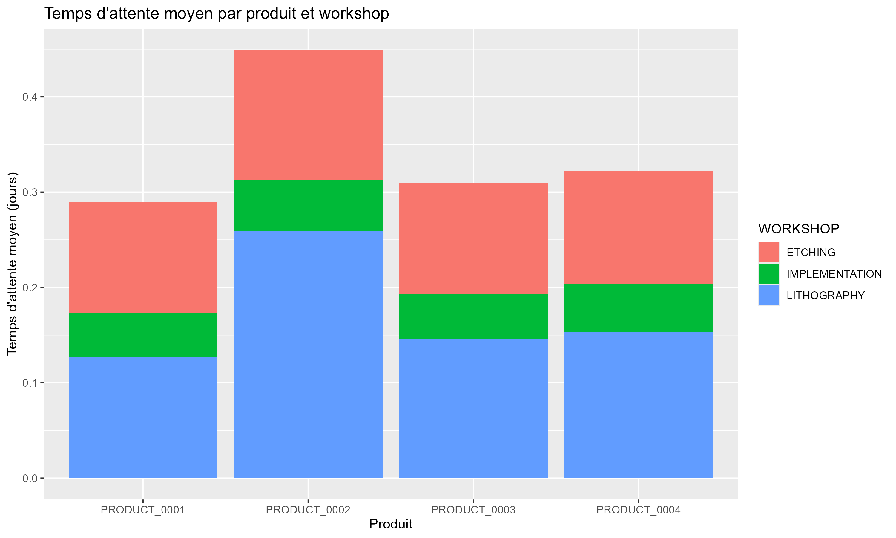
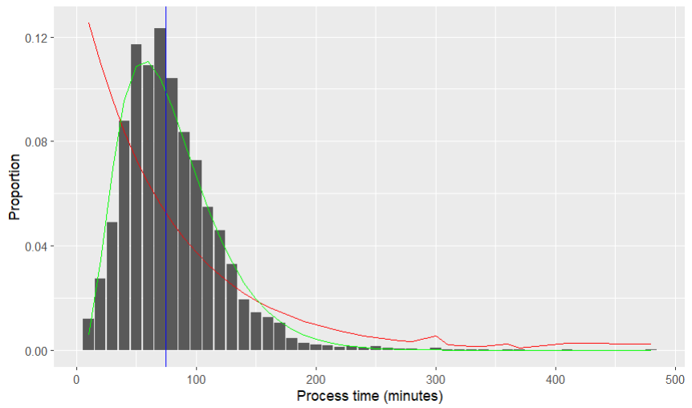

# Wafer Fab Digital Twin


> **Data-driven digital twin of a semiconductor wafer fab — bottleneck detection, processing-time modeling, and lot-priority simulation**

## Overview

A wafer fab is one of the most complex manufacturing environments in industry: hundreds of machines, multiple production stages, and routes spanning hundreds of operations per product. Small disruptions — a machine breakdown, a congested workshop, a poor priority call — cascade into significant delays.

This project builds a **digital twin** of a simulated wafer fab (4 products, 130 machines, 3 workshops) from one year of production logs (~1.3M process records), to:

- Identify the workshop that structurally limits the fab's throughput
- Model a machine's processing-time distribution and predict it from production context
- Simulate the fab's lot-selection policy and validate it against real occupation levels

## 1. Finding the bottleneck

Workshop occupation (WIP) was reconstructed from raw entry/exit events, distinguishing lots being **processed** (`L_machine`) from lots **queued or processed** (`L_workshop`). The gap between the two is queue size, the clearest signal of congestion.



For LITHOGRAPHY, `L_machine` sits flat at ~40 for the entire year, its machines are saturated at all times, not just during demand spikes. `L_workshop`, by contrast, swings constantly, meaning the queue absorbs all the variability the machines can't. ETCHING shows the same pattern at a smaller scale; IMPLEMENTATION shows neither, and its two curves stay close together.

The per-step waiting time breakdown confirms it: LITHOGRAPHY is the dominant contributor for every single product, not just the ones that route through it the most.



Quantified, the picture is unambiguous:

| Workshop | Utilization | Breakdown rate | Max theoretical throughput |
|---|---|---|---|
| **LITHOGRAPHY** | **99.6%** | 0.07% | **0.281 lots/h** (lowest) |
| ETCHING | 96.1% | 0.62% | 0.306 lots/h |
| IMPLEMENTATION | 93.4% | 0.06% | 0.282 lots/h |

**LITHOGRAPHY is the structural bottleneck**, near-total utilization, a negligible breakdown rate (so it's demand, not failures, driving the congestion), and the lowest ceiling on throughput.

## 2. Modeling processing time

To predict how long a lot will occupy a machine, the first step was choosing the right distribution to model. Processing times are strictly positive with a mode around 40–50 minutes and a long right tail, a shape an Exponential distribution (always decreasing from zero) cannot reproduce.



A Gamma distribution (green) fits this shape well, so processing time was modeled as a **Gamma GLM** (`log(E[S]) = β₀ + β₁X₁ + ... `), with 8 specifications compared on a held-out test set:

| Model | Predictors | Training scope | MAPE |
|---|---|---|---|
| 1 | Intercept only | Single machine | 1.07 |
| 3 | `RECIPE` | Single machine | 0.906 |
| 6 | `RECIPE` | All machines sharing recipes | 0.863 |
| **7** | **`RECIPE + PRODUCT`** | **All machines sharing recipes** | **0.862** |
| 8 | `RECIPE + PRODUCT + RECIPE_CONTINUITY` | Single machine | 0.861 |

Recipe is by far the dominant predictor, it drops MAPE from 1.07 to 0.906 on its own. Product adds nothing once recipe is known. Pooling training data across every machine that shares a recipe improves generalization further (0.906 → 0.863), and a "no-setup-change" flag (`RECIPE_CONTINUITY`, TRUE when consecutive operations share a recipe) is a significant, physically-sensible predictor: skipping a setup change measurably speeds up processing.

## 3. Simulating the priority policy

When a machine frees up, it must pick which waiting lot to process next. This was modeled as a score-weighted random choice: `P(select product i) = (lᵢ·sᵢ) / Σ(lⱼ·sⱼ)`, where `lᵢ` is the number of waiting lots of product `i` and `sᵢ` its priority score. Scores were estimated by maximizing the likelihood of the real, observed selection order.

The fitted scores (`PRODUCT_0001` fixed as reference = 1.0) came out at 0.43 / 0.83 / 0.78 for products 2–4, meaning `PRODUCT_0002`, the slowest product, is deprioritized relative to the others, which is exactly the kind of flow-smoothing behavior you'd expect from a well-run fab.

Simulating the machine event-by-event with these scores and comparing simulated vs. real occupation levels validates the model:

| | Uniform priority (baseline) | MLE-fitted priority |
|---|---|---|
| MAE on `PRODUCT_0002` occupation | 8.27 lots | **2.89 lots (−65%)** |
| MAE across all products | — | **2.9 – 4.1 lots** |

The fitted policy reproduces real fab behavior closely enough to be used for **what-if simulation** ,testing new priority rules without touching actual production.

## Repository structure

```
wafer-fab-digital-twin/
├── scripts/
│   ├── 01_exploratory_analysis.R   # Cycle time, WIP, utilization, bottleneck analysis
│   └── 02_machine_modeling.R       # Gamma regression models + priority policy simulation
├── data/
│   └── raw_data.zip                # 6 raw CSV tables (see below)
├── assets/                         # Figures used in this README
├── requirements.txt                # R package list
└── README.md
```

## Data

The `data/raw_data.zip` archive contains six CSV tables describing one year of simulated wafer fab production (lot routing, process timestamps, machine breakdowns, ~150 MB uncompressed). Decompress it into `data/` before running the scripts.

| Table | Content | Rows |
|---|---|---|
| `lot_process_table` | Every operation performed on every lot | 1,755,296 |
| `machine_breakdown_table` | Machine breakdown history | 277,107 |
| `lot_arrival_table` | Lot arrival and due dates | 21,931 |
| `interopt_table` | Machine–recipe compatibility per workshop | 2,658 |
| `product_route_table2` | Manufacturing route per product | 361 |
| `machine_table` | Machine characteristics (workshop, breakdown rate) | 130 |

## Running the scripts

```bash
git clone https://github.com/<your-username>/wafer-fab-digital-twin.git
cd wafer-fab-digital-twin
unzip data/raw_data.zip -d data/
```

In R:
```r
install.packages("tidyverse")
source("scripts/01_exploratory_analysis.R")
source("scripts/02_machine_modeling.R")
```

## Tech stack

| Tool | Use |
|---|---|
| R / tidyverse | Data wrangling, feature engineering |
| ggplot2 | Visualization |
| Gamma GLM (`glm`, `family = Gamma`) | Processing-time prediction |
| Maximum likelihood (`optim`) | Priority-score estimation |
| Discrete-event simulation | Priority policy validation |

## License

MIT — see [LICENSE](LICENSE).